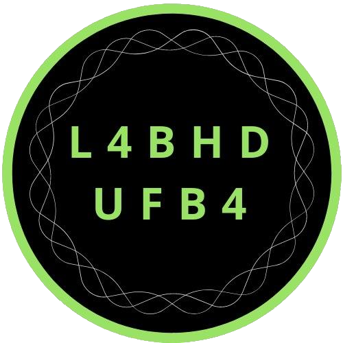

layout: true
  
<div class="my-footer"><span>
<a>Da sociologia digital às humanidades digitais: dilemas e oportunidades</a>
</span></div>


---
class: middle, center
```{r setup, include=FALSE}
options(htmltools.dir.version = FALSE)

knitr::opts_chunk$set(
	echo = FALSE,
	fig.align = "center",
	message = FALSE,
	warning = FALSE,
	cache = FALSE
)
```

```{r eval=FALSE, include=FALSE}
library(knitr)
library(tidyverse)
library(widgetframe)
```

# Leonardo F. Nascimento

```{r out.width="15%"}
knitr::include_graphics("img/logos_bia.png")
```
15% Programador, 20% Químico, 25% Psicólogo, 40% Cientista Social

[Email: **leofn3@gmail.com**](mailto:leofn3@gmail.com) 

[Twitter:**@leofn3**](http://www.twitter.com/leofn3) 

[website: **www.leofn.com**](http://www.leofn.com)

---

class: inverse, center, middle

# Era uma vez um N00b...

---
class: middle, center

## 2009: ATLAS.ti e Sphinx 
<br>
--

## 2010: Endnote e Zotero
<br>
--

## 2014 e 2015: R/Rstudio (MQ/UFMG)
<br>
--

## 2016: Webscraping em Python
<br>
--

## 2017...: Github, +R, +Python  
<br>

---
class: middle, center

# A descoberta da sociologia digital

```{r, out.width="60%"}
knitr::include_graphics("https://media0.giphy.com/media/CjmvTCZf2U3p09Cn0h/giphy-downsized.gif")
```

---
class: middle, center

--
# A descoberta da sociologia digital
<br>

--
## 2013: Digital Sociology: critical perspectives - Nick Prior e Kate Orton-Johnson
<br>
--

## 2014: Digital Sociology - Deborah Lupton
<br>
--

## 2017: Digital Sociology - Noortje Marres
<br>
--

## 2019: Digital Sociology - Neil Selwyn
<br>

---
class: middle, center

# A pré-histórica da sociologia digital
<br>

--
## 2000 - Reflections on the Future of Sociology - Andrew Abbott
<br>
--

## 2007 - The Coming Crisis of Empirical Sociology - Roger Burrows & Mike Savage
<br>

--

## 2012 - A Ciência Social digitalizada: avanços, oportunidades e desafios - James Witte

---
class: middle, center

# A condição do estrangeiro digital

```{r, out.width="100%"}
 
```
Fonte: "https://www.deviantart.com/maye6/art/Bridge-Between-Two-Worlds-374582242"

---

class: middle, center

--
# A condição do estrangeiro digital
<br>

--

## Nem programador, nem cientista social
<br>

--

## Nem químico, nem psicólogo, nem sociólogo...
<br>

--

## Experiência interdisciplinar e/ou aberração epistemológica?
<br>

---

class: middle, center

# As humanidades digitais como abrigo

```{r, out.width="60%"}
knitr::include_graphics("https://media.giphy.com/media/hKrpeqRJowwi4/giphy.gif")
```

---
class: middle, center

--
# As humanidades digitais como abrigo
<br>

--
## O "digital turn" é geral, irrestrito e irreversível!
<br>

--
## A indefinição do campo é um convite para híbridos/aberrações
<br>

--
## Diferenças teóricas e metodológicas fortalecem as análises
<br>

--
## Ciência aberta: dados e códigos

---

class: middle, center  

```{r, out.width="50%"}

```

# Surge em 2018 na UFBA em Salvador/Bahia

# Historiadores, sociólogos, físicos, cientistas de dados etc.

---

class: inverse, center, middle

# Para concluir!

---
class: middle, center

--
# Desafios das humanidades digitais
<br>

--
## Digitalização e Dataficação 
<br>

--
## Dados Digitais
<br>

--
## Métodos digitais
<br>

--
## Dilemas éticos
<br>


---

class:  middle, center

--
# Aprendam métodos digitais
<br>

--
# As grades curriculares precisam incluir Humanidades Digitais
<br>

--
# ANPOCS, por favor, permita o debate sobre a Sociologia Digital no Brasil <br>

---

class:  middle, center

# Obrigado gente!

.pull-left[
```{r, out.width="100%"}
knitr::include_graphics("https://media1.giphy.com/media/3oz8xIsloV7zOmt81G/giphy.gif")
```
]

.pull-right[
**Agradecimentos especiais**:
### Ao Prof. Ricardo Pimenta e todos os membros do LARUHD pelo convite!

###Aos colegas da mesa!
]

---
class: middle, center  

# LABHDUFBA nas redes:


```{r, out.width="35%"}

```

Twitter: [@labhdufba](https://twitter.com/labhdufba), 
Instagram: [@labhdufba](http://instagram.com/labhdufba)
Github: [https://github.com/LABHDUFBA](https://github.com/LABHDUFBA)
Youtube: [Clique aqui](https://www.youtube.com/channel/UCjUf9BsbG-C-gpA54zvOgBw)

